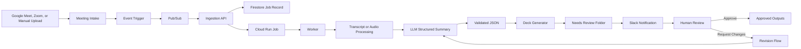

# Meeting Intelligence Automation

## What this does

This workflow turns a meeting recording or transcript into a short, editable leadership package.

It creates:

* An executive summary
* Three high-level objectives
* Three actionable items
* Next steps
* A PowerPoint or Google Slides deck
* A JSON summary with evidence from the transcript

The system is designed to save time, but a person must review and approve every output before it is shared.

---

## Main idea

The AI does not create the PowerPoint directly.

First, it creates a structured JSON summary. That JSON is checked, saved, and then used to generate the slide deck.

```text
Meeting recording or transcript
  ->
Transcript preparation
  ->
AI creates structured JSON
  ->
JSON validation
  ->
PowerPoint or Google Slides generation
  ->
Needs Review
  ->
Human approval or feedback
```

The JSON is the source of truth. The deck is the editable presentation created from that JSON.

---

## Architecture



---

## How a meeting enters the system

There are three possible intake paths.

### Google Meet

Google Meet creates a recording or transcript. An event tells our system that the file is ready.

### Zoom

Zoom sends a webhook after a cloud recording is completed. The system retrieves the transcript first, then audio if no transcript exists.

### Manual upload

For the first version, someone can upload a transcript, audio, or video file into the "Meeting Intake" folder.

Supported files:

```text
.txt
.mp3
.m4a
.wav
.mp4
```

Manual upload is the easiest way to prove the POC. Google Meet and Zoom are later integrations using the same downstream workflow.

---

## Why Pub/Sub is only used for events

Pub/Sub does not do the AI work.

It only sends a quick message saying:

```text
"A new meeting file is available."
```

The ingestion API receives that message, creates a job record, starts the worker, and returns success immediately.

```text
Pub/Sub
  ->
Ingestion API
  ->
Create job in Firestore
  ->
Start worker
  ->
Return success
```

This avoids keeping a Pub/Sub request open while transcription, AI processing, and presentation creation are running.

---

## Core components

| Component            | Purpose                                                               |
| -------------------- | --------------------------------------------------------------------- |
| Google Drive         | Holds intake files, review files, approved outputs, and archive files |
| Google Meet or Zoom  | Provides recordings and transcripts                                   |
| Pub/Sub              | Sends lightweight event notifications                                 |
| Ingestion API        | Validates events and creates jobs quickly                             |
| Firestore            | Stores job status, files, versions, errors, and audit history         |
| Cloud Run Job        | Runs the long AI processing workflow                                  |
| LLM                  | Creates the structured meeting summary                                |
| PowerPoint generator | Builds an editable `.pptx` deck from validated JSON                   |
| Slack                | Notifies reviewers when output is ready                               |
| Human reviewer       | Approves, edits, rejects, or requests revision                        |

---

## Ingestion API

The ingestion API should be small and fast.

It does this:

1. Receives a meeting event.
2. Identifies the source file.
3. Checks that the file type is supported.
4. Creates a unique job ID.
5. Saves the job in Firestore.
6. Starts the worker.
7. Returns success.

It does not do this:

* Download large recordings
* Transcribe audio
* Call the LLM
* Create slides
* Wait for AI processing to finish

---

## Worker flow

The worker receives a `job_id` and does the heavier work.

```text
Load job
  ->
Download or open source file
  ->
Use transcript if available
  ->
Transcribe audio only when needed
  ->
Create AI JSON summary
  ->
Validate JSON
  ->
Generate editable deck
  ->
Save files in Needs Review
  ->
Update job status
  ->
Notify reviewer
```

The worker should use a Cloud Run Job in production because recordings and AI processing can take longer than a normal web request.

---

## Job tracking

Firestore keeps one record for each processed meeting.

Example:

```json
{
  "job_id": "drive_file_id_version_hash",
  "status": "PROCESSING",
  "source_file_name": "weekly_ops_review.mp4",
  "source_file_version": "4",
  "transcript_path": null,
  "summary_path": null,
  "deck_path": null,
  "created_at": "2026-07-06T18:00:00Z",
  "error_message": null
}
```

Job statuses:

```text
RECEIVED
QUEUED
PROCESSING
NEEDS_REVIEW
APPROVED
REJECTED
FAILED
```

The job ID must be based on the file ID and file version. This prevents duplicate events from creating duplicate decks.

---

## AI output

The LLM creates JSON similar to this:

```json
{
  "meeting_title": "Weekly Operations Review",
  "executive_summary": "Short summary of the discussion.",
  "objectives": [
    {
      "objective": "Reduce manual reporting effort.",
      "evidence": [
        {
          "timestamp": "06:48",
          "speaker": "Marcus",
          "source_text": "Maybe 15 to 20 hours a month."
        }
      ]
    }
  ],
  "action_items": [
    {
      "action": "Test a meeting intelligence pilot using historical leadership meetings.",
      "owner": "Marcus",
      "due_date": null,
      "priority": "high",
      "business_rationale": "This supports the immediate reporting and leadership alignment need.",
      "evidence": [
        {
          "timestamp": "17:04",
          "speaker": "Alex",
          "source_text": "Take three historical meeting recordings..."
        }
      ]
    }
  ],
  "next_steps": [
    {
      "step": "Review pilot quality, cost, and time savings.",
      "owner": null,
      "timeframe": "After the pilot"
    }
  ],
  "risks_and_uncertainties": [
    "No final owner was confirmed for every action item."
  ]
}
```

The model must:

* Use only information from the transcript.
* Generate exactly three objectives.
* Generate exactly three action items.
* Avoid inventing owners, deadlines, or numbers.
* Use `null` where information is missing.
* Include evidence for important claims.
* Clearly state uncertainty.

---

## Slide deck output

The presentation generator reads the validated JSON and creates an editable deck.

Suggested deck:

1. Meeting title and executive summary
2. Three objectives
3. Three action items
4. Next steps
5. Risks and evidence references

The deck should be clear and editable, not visually complex.

---

## Needs Review and feedback loop

The reviewer receives:

```text
Needs Review/
  /job_id/
    normalized_transcript.txt
    meeting_summary_v1.json
    meeting_deck_v1.pptx
    audit_metadata.json
```

The reviewer can choose one of four actions:

| Action                  | Result                                                      |
| ----------------------- | ----------------------------------------------------------- |
| Approve                 | Files move to Approved Outputs                              |
| Request content changes | AI creates a revised JSON and regenerated deck              |
| Request layout changes  | Renderer updates the deck without changing the content JSON |
| Edit deck manually      | Deck is marked as manually edited                           |

### Content revision flow

The AI should never edit the PowerPoint directly.

```text
Reviewer feedback
  +
Original transcript
  +
Current JSON summary
  ->
LLM revision request
  ->
New JSON version
  ->
Validation
  ->
New deck version
  ->
Needs Review again
```

For example:

```text
meeting_summary_v1.json
  ->
Reviewer says: "Remove the assumed deadline and make action item two more specific."
  ->
meeting_summary_v2.json
  ->
meeting_deck_v2.pptx
```

Every version stays in the archive.

```text
Archive/job_id/
  normalized_transcript.txt
  meeting_summary_v1.json
  meeting_deck_v1.pptx
  feedback_v1.json
  meeting_summary_v2.json
  meeting_deck_v2.pptx
```

### Manual deck edits

A reviewer can edit the deck manually for small wording or visual changes.

However, manual PowerPoint changes do not automatically update the JSON.

```text
JSON update
  ->
Safe deck regeneration

Manual deck edit
  ->
Deck-only change
```

A manually edited deck must be marked `MANUALLY_EDITED` so a later automated revision does not overwrite it.

---

## Human approval

Nothing is sent to leadership automatically.

```text
Worker creates outputs
  ->
Needs Review folder
  ->
Slack notification
  ->
Reviewer checks summary and deck
  ->
Approve, reject, edit, or request revision
```

This is important because the workflow supports leadership decisions and action items. AI can prepare the material, but people remain responsible for final approval.

---

## Local development

The local POC uses the same logic without requiring live Google Meet or Google Drive events.

```text
Fake Drive event script
  ->
Local FastAPI ingestion API
  ->
Firestore emulator
  ->
Pub/Sub emulator
  ->
Local Python worker
  ->
local_storage/needs_review
```

Local folders:

```text
local_storage/
  intake/
  needs_review/
  approved_outputs/
  failed/
  archive/
```

The local POC should prove:

1. A transcript enters the intake folder.
2. A fake event creates a job.
3. The worker processes the transcript.
4. JSON is generated.
5. An editable PowerPoint is generated.
6. The job reaches `NEEDS_REVIEW`.
7. A duplicate event does not create a duplicate deck.

---

## Production mapping

| Local version       | Production version                                     |
| ------------------- | ------------------------------------------------------ |
| Fake event script   | Google Meet event, Zoom webhook, or Drive change event |
| Local FastAPI app   | Cloud Run ingestion API                                |
| Pub/Sub emulator    | Google Pub/Sub                                         |
| Firestore emulator  | Firestore                                              |
| Local worker        | Cloud Run Job                                          |
| Local folders       | Google Drive and Cloud Storage                         |
| Console logs        | Cloud Logging                                          |
| Manual notification | Slack notification                                     |

---

## Error handling

| Problem                 | Expected result                             |
| ----------------------- | ------------------------------------------- |
| Unsupported file        | Mark job as `REJECTED`                      |
| File missing            | Mark job as `FAILED`                        |
| Audio extraction fails  | Save clear error and mark `FAILED`          |
| Transcription fails     | Retry once, then mark `FAILED`              |
| AI returns invalid JSON | Retry once with a repair request            |
| Deck generation fails   | Preserve transcript and JSON, mark `FAILED` |
| Duplicate event         | Ignore safely                               |
| Reviewer rejects output | Mark job as `REJECTED` and save feedback    |

Every failure should include the job ID, processing stage, error message, and timestamp.

---

## Security and data handling

* Store API keys and OAuth tokens in Secret Manager.
* Never commit secrets to GitHub.
* Limit access to meeting files and output folders.
* Use least-privilege service accounts.
* Keep raw recordings separate from approved outputs.
* Keep transcripts, generated JSON, and revision feedback for audit purposes.
* Make data retention configurable.

Suggested retention:

```text
Raw recordings: 30 days
Transcripts: 90 days
Approved decks: 180 days
Job logs and audit history: 365 days
```

---

## Why this design

This design is intentionally simple.

* Pub/Sub handles events.
* Firestore tracks jobs.
* Cloud Run Jobs handle slow AI work.
* JSON keeps AI output structured and auditable.
* The deck is generated from JSON, not directly by the model.
* Human review prevents unapproved outputs from being distributed.
* Feedback creates new versions instead of overwriting previous work.
* The same workflow supports manual uploads now and Meet or Zoom automation later.
